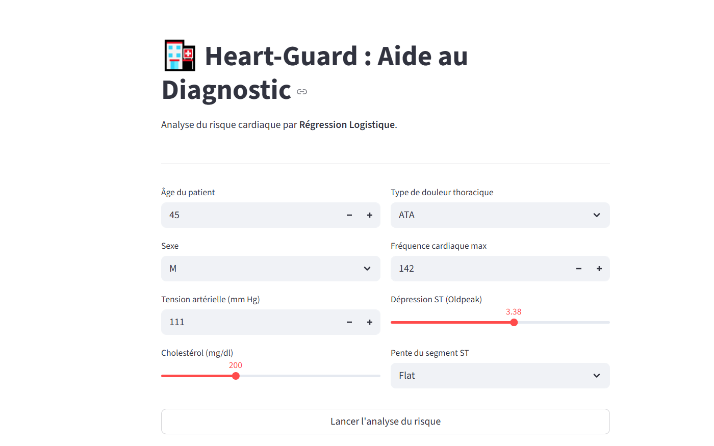

# 🏥 Heart-Guard : Aide au Diagnostic Cardiaque

  

**Heart-Guard** est une application web intelligente conçue pour évaluer le risque de pathologie cardiaque chez un patient. 
Ce projet est une **démonstration technique** dont le but est d'illustrer ma méthodologie de travail, ma maîtrise du code et des concepts de Machine Learning (ML).

---

## 🎯 Objectif du Projet
Ce dépôt présente mes compétences de Data Scientist et ma capacité à livrer un projet de bout en bout :
- **Manipulation de Code** : Écriture d'un code propre, modulaire et commenté.
- **Architecture Propre** : Séparation stricte entre la logique de calcul (`src/`), les données (`data/`) et l'interface utilisateur (`app.py`).
- **Pipeline ML Complet** : De l'analyse exploratoire (EDA) via Notebooks jusqu'à l'entraînement du modèle (Régression Logistique).
- **IA Explicable (XAI)** : Implémentation de visualisations permettant de comprendre l'influence de chaque variable sur le score de risque.

---

## 🌟 Fonctionnalités
- **Analyse en temps réel** : Saisie simplifiée des données patient (âge, cholestérol, tension, etc.).
- **Score de Risque** : Calcul instantané de la probabilité de risque cardiaque.
- **Interprétabilité** : Graphique d'impact montrant quels facteurs pèsent le plus dans la décision de l'IA.
- **Recommandations** : Interprétation médicale basée sur les seuils de probabilité.
